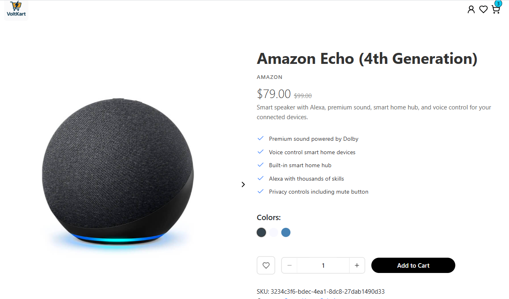
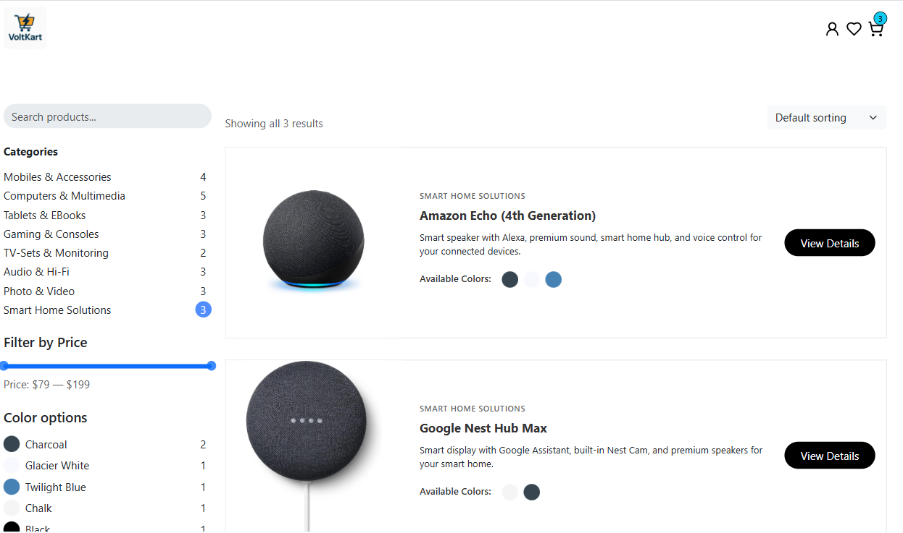
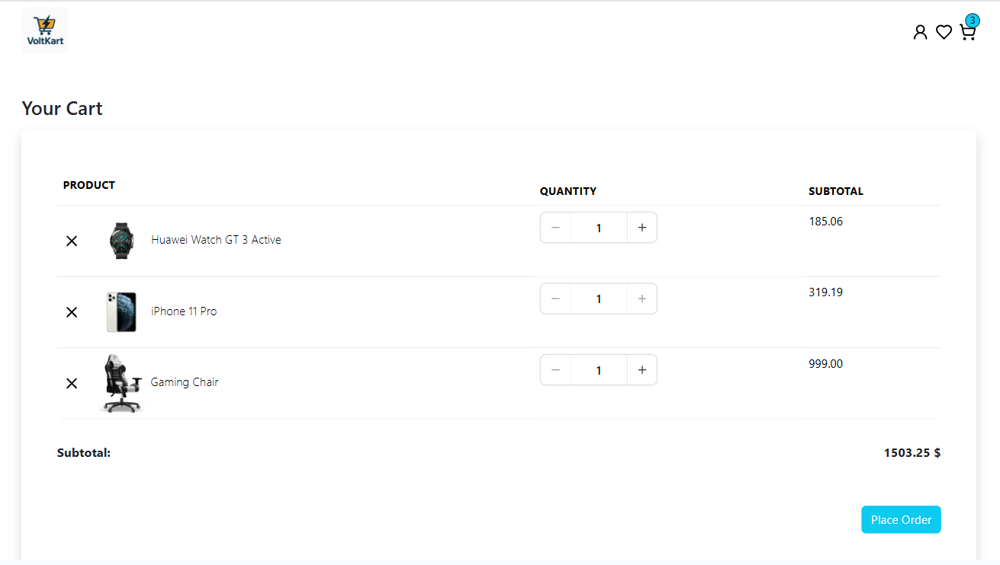
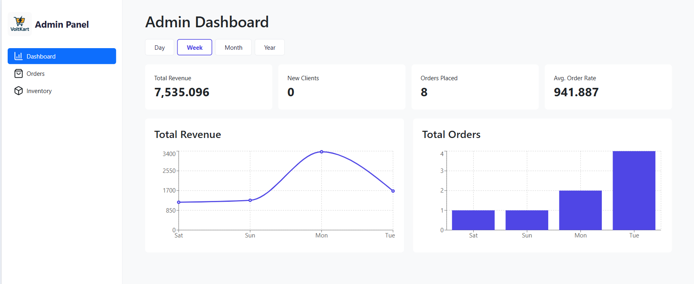

# VoltKart ⚡

A modern, full-stack e-commerce platform specializing in electronics, built with React and powered by Supabase. VoltKart offers a seamless shopping experience with comprehensive features for both customers and administrators.

## 🚀 Features

### Customer Features

- **User Authentication** - Registration and login system
- **Product Browsing** - Explore our electronics catalog with detailed product information
- **Shopping Cart** - Add products to cart with purchase limit controls
- **Wishlist** - Save favorite products for later
- **Order Management** - Track your orders from purchase to delivery
- **Responsive Design** - Optimized for desktop, tablet, and mobile devices
- **Secure Payments** - Integrated with Stripe for safe transactions

### Admin Features

- **Dashboard** - Metrics and analytics
- **Inventory Management** - Track and manage product stock
- **Product Management** - Add products
- **Order Tracking** - Monitor all customer orders

## 📸 Screenshots

<!-- ### Homepage -->

<!--  -->

### Product Page



### Products Page



### Shopping Cart



### Admin Dashboard



## 🛠️ Tech Stack

### Frontend

- **React** - UI library for building user interfaces
- **Redux Toolkit** - State management
- **Bootstrap & React-Bootstrap** - UI components and styling
- **Zod** - Schema validation
- **React Hook Form** - Form handling and validation
- **Vite** - Build tool and development server

### Backend & Services

- **Supabase** - Backend-as-a-Service (database, authentication, real-time features)
- **Stripe** - Payment processing

### Deployment

- **Vercel** - Frontend hosting and deployment

## 🚀 Getting Started

### Prerequisites

- Node.js (v16 or higher)
- npm or yarn
- Git

### Installation

1. **Clone the repository**

   ```bash
   git clone https://github.com/Marwan878/VoltKart.git
   cd VoltKart
   ```

2. **Install dependencies**

   ```bash
   npm install
   ```

3. **Environment Setup**
   Create a `.env` file in the root directory and add your environment variables:

   ```env
   VITE_SUPABASE_URL=your_supabase_project_url
   VITE_SUPABASE_ANON_KEY=your_supabase_anon_key
   VITE_STRIPE_PUBLISHABLE_KEY=your_stripe_publishable_key
   ```

4. **Start the development server**

   ```bash
   npm run dev
   ```

5. **Open your browser**
   Navigate to `http://localhost:5173` to see the application running.

## 📦 Available Scripts

- `npm run dev` - Start development server
- `npm run build` - Build for production
- `npm run preview` - Preview production build locally
- `npm run lint` - Run ESLint for code quality

## 🗂️ Project Structure

```
VoltKart/
├── index.html
├── package.json
├── package-lock.json
├── vercel.json
├── vite.config.ts
├── tsconfig.json
├── tsconfig.node.json
├── public/
│ ├── brand.png
│ └── screenshots/
├── src/
│ ├── main.tsx
│ ├── vite-env.d.ts
│ ├── assets/
│ │ └── lottieFiles/
│ ├── components/
│ │ ├── account/
│ │ ├── admin/
│ │ ├── auth/
│ │ ├── cart/
│ │ ├── common/
│ │ ├── feedback/
│ │ ├── form/
│ │ ├── home/
│ │ ├── Product/
│ │ ├── productsPage/
│ │ ├── register/
│ │ ├── ui/
│ │ └── wishlist/
│ ├── config/
│ ├── constants/
│ ├── hooks/
│ ├── layouts/
│ │ ├── AdminLayout/
│ │ ├── MainLayout/
│ │ └── ProfileLayout/
│ ├── lib/
│ ├── pages/
│ │ └── Admin/
│ ├── routes/
│ ├── store/
│ │ ├── auth/
│ │ ├── cart/
│ │ ├── dashboardOrders/
│ │ ├── inventory/
│ │ ├── metrics/
│ │ ├── orders/
│ │ ├── products/
│ │ ├── toasts/
│ │ └── wishlist/
│ ├── styles/
│ ├── types/
│ ├── utils/
│ └── validations/
└── README.md
```

## 🔧 Configuration

### Supabase Setup

1. Create a new project on [Supabase](https://supabase.com)
2. Set up your database tables for products, users, orders, etc.
3. Configure authentication providers
4. Add your Supabase URL and anon key to your `.env` file

### Stripe Setup

1. Create a [Stripe](https://stripe.com) account
2. Get your publishable key from the Stripe dashboard
3. Add the key to your `.env` file
4. Configure webhooks for order processing

## 🌐 Deployment

The application is deployed on Vercel. To deploy your own instance:

1. Fork this repository
2. Connect your GitHub account to Vercel
3. Import the project to Vercel
4. Add your environment variables in Vercel's dashboard
5. Deploy!

## 🎯 Future Enhancements

- Product reviews and ratings
- Email notifications
- Multi-language support

## 🤝 Contributing

Contributing is more than welcome in this project.

If you'd like to contribute:

1. Fork the repository
2. Create a feature branch
3. Make your changes
4. Submit a pull request

## ✔️ Acknowledgments

- Built as a practice project to learn modern web development
- Thanks to the open-source community for the amazing tools and libraries
- Special thanks to Supabase and Stripe for their excellent services

## 📞 Contact

If you have any questions or suggestions, feel free to reach out!

---

**VoltKart** - Powering your electronics shopping experience ⚡
